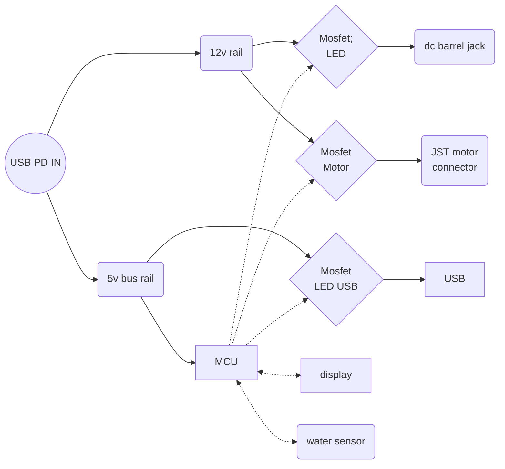

# SmartBasil
Stop killing my Basil plant and to allow me to go on 1month vacations without stressing about my Herbs

```mermaid 
graph LR
    PD((USB PD IN )) --> 12v(12v rail) & 5v(5v bus rail);
   12v --> LED{Mosfet;
   LED} --> DC(dc barrel jack);
   12v --> Motor{"Mosfet 
   Motor"} --> motorCOnnector("JST motor 
   connector");

   5v -->  LEDBus{"Mosfet 
   LED USB"} --> USB;

   5v --> MCU -.-> LED & LEDBus & Motor;
   MCU <-.-> display & water(water sensor);
```